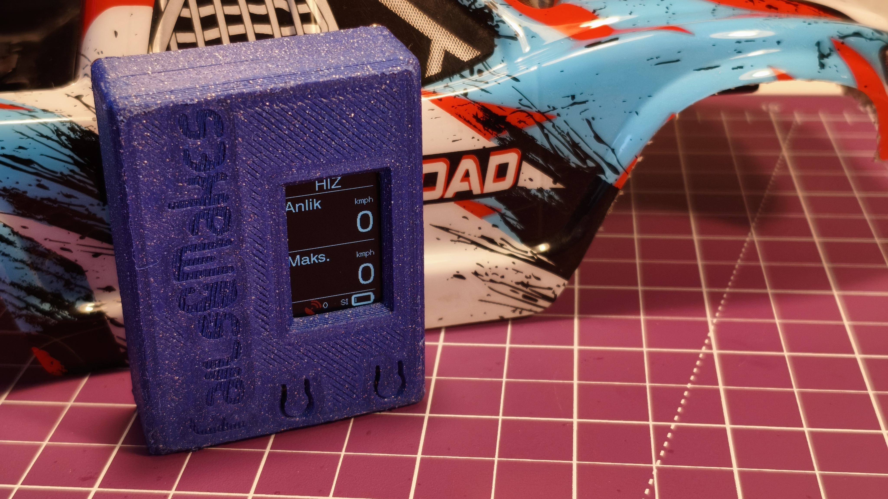

# 🛰️ RC Araçlar için GPS Hız & Drag Süresi Ölçer

Bu proje, RC araçlarda gerçek zamanlı hız ve drag süresi ölçümü yapmanızı sağlayan bir DIY cihazdır.  
**TTGO T-Display ESP32**, **ATGM336H GPS modülü** ve **AA boyutunda Li-Ion şarjlı batarya** kullanılarak oluşturulur. Tüm bileşenler özel tasarım bir **3D baskı kasaya** yerleştirilir.

[📽️ YouTube videosunu izlemek için tıklayın (fails&makes)](https://www.youtube.com/@failsmakes)  
[📦 3D baskı kasa tasarımı için Printables bağlantısı](https://www.printables.com/)

---

---

## 🔧 Donanım

- TTGO T-Display ESP32 geliştirme kartı  
- GPS modülü (ATGM336H)  
- AA boyutunda (14500L) Li-ion batarya  
- 1S BMS Kartı
- Mikro slide switch
- 3D baskı kasa

---

## 💡 Özellikler

- GPS ile anlık ve maksimum hız ve yükseklik ölçümü  
- Drag zamanı ölçümü (örneğin 0–50 km/s ve 0-40metre)
- Enlem ve boylam olarak konum bilgisi
- Renkli TFT ekranda veri gösterimi  
- Batarya durumu göstergesi  
- Kompakt ve taşınabilir yapı

---

## 🔌 Bağlantı Şeması

| TTGO T-Display | GPS Modülü |
|----------------|------------|
| 3.3V           | VCC        |
| GND            | GND        |
| GPIO25 (RX)    | TX         |
| GPIO26 (TX)    | RX         |

> ⚠️ Farklı bir GPS modülü kullanıyorsanız voltaj uyumluluğunu kontrol edin.

---

## 🧠 Lisans

Bu proje GNU AFFERO GENERAL PUBLIC LICENSE Lisansı ile açık kaynak olarak paylaşılmıştır. Forklayabilir, geliştirebilir, katkı sağlayabilirsiniz.

---

# 🛰️ GPS Speed & Drag Time Meter for RC Vehicles

This project is a DIY device that allows you to measure real-time speed and drag time on RC vehicles.  
It’s built using a **TTGO T-Display ESP32**, an **ATGM336H GPS module**, and a **14500-size rechargeable Li-Ion battery**. All components are housed inside a custom-designed **3D-printed enclosure**.

[📽️ Click to watch the YouTube video (fails&makes)](https://www.youtube.com/@failsmakes)  
[📦 Link to the 3D printable enclosure on Printables](https://www.printables.com/)

---

---

## 🔧 Hardware

- TTGO T-Display ESP32 development board  
- GPS module (ATGM336H)  
- 14500-size Li-Ion battery  
- 1S BMS board  
- Micro slide switch  
- 3D-printed case

---

## 💡 Features

- Real-time and maximum speed & altitude measurement via GPS  
- Drag time measurement (e.g., 0–50 km/h and 0–40 meters)  
- Latitude and longitude position tracking  
- Data display on color TFT screen  
- Battery level indicator  
- Compact and portable design

---

## 🔌 Wiring Diagram

| TTGO T-Display | GPS Module |
|----------------|------------|
| 3.3V           | VCC        |
| GND            | GND        |
| GPIO25 (RX)    | TX         |
| GPIO26 (TX)    | RX         |

> ⚠️ If you're using a different GPS module, make sure to check the voltage compatibility.

---

## 🧠 License

This project is open-source and licensed under the **GNU AFFERO GENERAL PUBLIC LICENSE**.  
You are free to fork, modify, and contribute.

---

